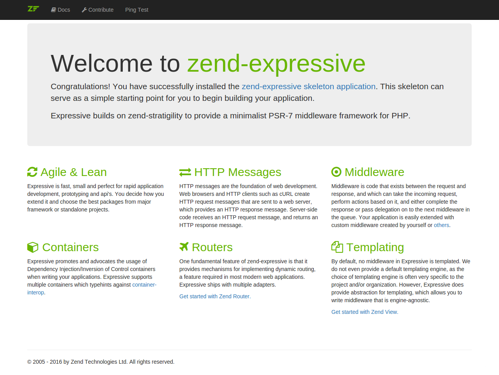

# Part 1: Setup the application

This tutorial is intended to give an introduction to `Zend\Expressive` to
build PSR-7 middleware applications with the Zend Framework. In the 
tutorial you will build a simple database driven application step-by-step. 
At the end of the tutorial you will have a working ZF3 middleware 
application to use as a starting point for your own applications.

## Create a new project with installer

First, we want to create a new project by using Composer. Please run the 
following command:

```
$ composer create-project -s rc zendframework/zend-expressive-skeleton zend-expressive-tutorial
```

Now you will be asked a couple of questions to choose from the packages to
be installed with the `Zend\Expressive` skeleton:

* Choose to install a minimal skeleton. For this tutorial please choose 
  `n` for a full skeleton. 
* Choose a router from the selection of Aura.Router, FastRoute or Zend 
  Router. For this tutorial please choose `3` for the Zend Router.
* Choose a DI container from the selection of Aura.Di, Pimple and Zend
  ServiceManager. For this tutorial please choose `3` for the Zend 
  ServiceManager.
* Choose a template engine from the selection of Plates, Twig and Zend
  View. For this tutorial please choose `3` for the Zend View.
* Choose an error handler from the section of Whoops or none. For this
  tutorial please choose `1` for Whoops error handler.

The output on your screen should look like this:


When the installer is finished, you should run a Composer update to remove
all packages which were installed during the project creation and are not
needed anymore. Enter the project directory and run:

```
$ composer update
```

To watch the new project in your browser you can easily use PHPs 
[build-in web server](http://php.net/manual/en/features.commandline.webserver.php).
Again, use composer to start it:

```
$ composer serve
```

By default composer will terminate with a `ProcessTimedOutException` after
300 seconds. Via the `COMPOSER_PROCESS_TIMEOUT` environment variable you
may change that behavior.

```
$ export COMPOSER_PROCESS_TIMEOUT=86400
$ composer serve
or
$ COMPOSER_PROCESS_TIMEOUT=86400 composer serve
```

This starts up a web server on localhost port 8080; browse to 
[http://localhost:8080/](http://localhost:8080/) to see if your 
application responds correctly!



## Compare with example repository branch `part1`

You can easily compare your code with the example repository when looking 
at the branch `part1`. If you want you can even clone it and have a deeper
look.

[https://github.com/RalfEggert/zend-expressive-tutorial/tree/part1](https://github.com/RalfEggert/zend-expressive-tutorial/tree/part1)
