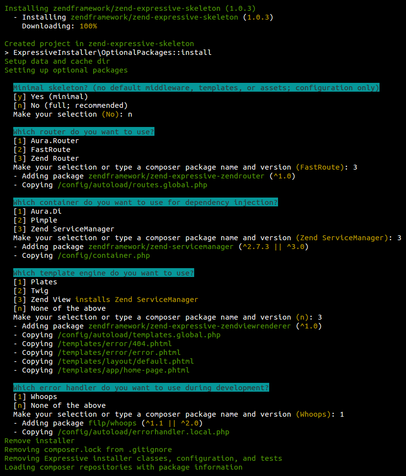

# Part 1: Setup the application

This tutorial provides an introduction to Expressive, and building
[PSR-7](http://www.php-fig.org/psr/psr-7/) middleware applications. You will
build a simple database driven application step-by-step, which you can then use
as a starting point for your own applications.

## Create a new project with the installer

To begin, we will create a new project by using
[Composer](https://getcomposer.org).

> ### Get Composer
>
> If you haven't already, install Composer, per the instructions
> [on their website](https://getcomposer.org/doc/00-intro.md#installation-linux-unix-osx).

Please run the following command:

```bash
$ composer create-project zendframework/zend-expressive-skeleton zend-expressive-tutorial
```

The installer will prompt you with several questions, asking you
to choose packages to install. These include the following:

- `Minimal skeleton? (no default middleware, templates or assets; configuration
  only)`: For the tutorial, please choose `n` (the default selection) for a full
  skeleton. 
- `Which router do you want to use?`: please choose `3`, for the Zend Router.
- `Which container do you want to use for dependency injection?`: please choose
  `3` (the default selection), for zend-servicemanager.
- `Which template engine do you want to use?`: please choose `3`, for Zend View.
- `Which error handler do you want to use during development?`: Please choose
  `1` (the default selection), for Whoops.

The output on your screen should look like this:



Once complete, enter the project directory:

```bash
$ cd zend-expressive-tutorial
```

You can now startup PHP's [built-in web server](http://php.net/manual/en/features.commandline.webserver.php);
the Expressive skeleton provides a short-cut for it via Composer:

```bash
$ composer serve
```

> Server timeout
> 
> By default composer will terminate with a `ProcessTimedOutException` after
> 300 seconds (5 minutes). If you want it to run longer, you can alter the timeout
> via the `COMPOSER_PROCESS_TIMEOUT` environment variable:
> 
> ```bash
> $ export COMPOSER_PROCESS_TIMEOUT=86400
> $ composer serve
> # or
> $ COMPOSER_PROCESS_TIMEOUT=86400 composer serve
> ```

This starts up a web server on localhost port 8080; browse to 
[http://localhost:8080/](http://localhost:8080/) to see if your 
application responds correctly!


## Compare with example repository branch `part1`

You can easily compare your code with the example repository when looking 
at the branch `part1`. If you want you can even clone it and have a deeper
look.

```bash
$ git clone https://github.com/RalfEggert/zend-expressive-tutorial.git
$ cd zend-expressive-tutorial
$ git checkout -b part1 origin/part1
```

Or view it online:

- [https://github.com/RalfEggert/zend-expressive-tutorial/tree/part1](https://github.com/RalfEggert/zend-expressive-tutorial/tree/part1)
